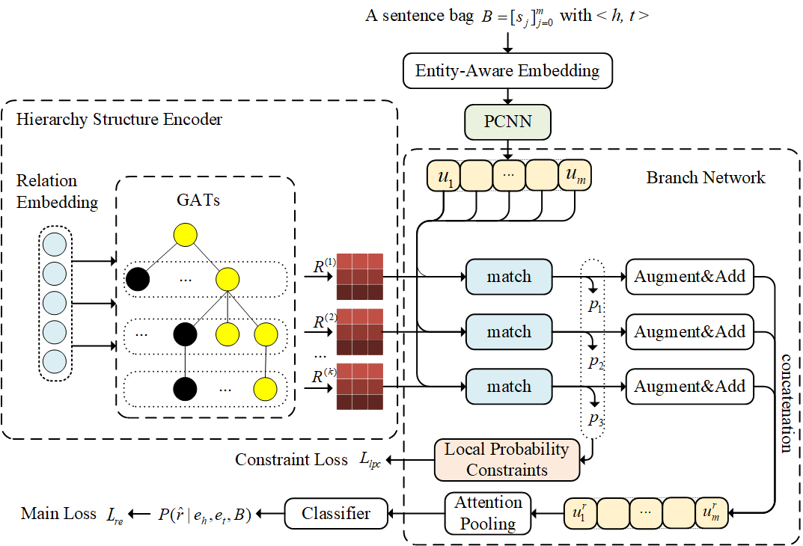
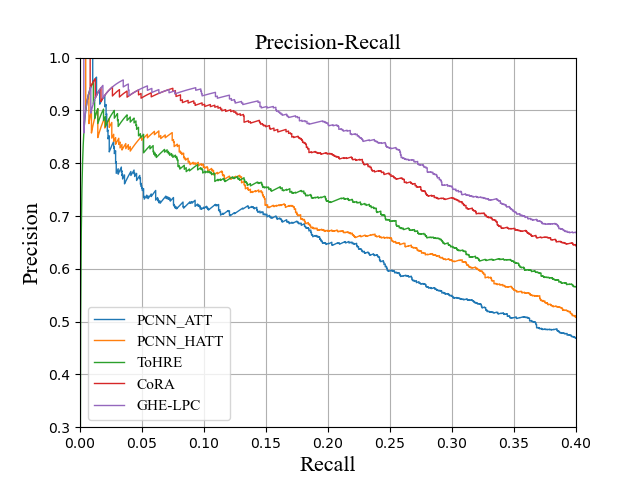

# GHE-LPC
<!-- A pytorch implementation of the paper: "Distantly Supervised Relation Extraction using Global Hierachy Embeddings and Local Probability Constraints". -->

Source codes for the paper "Distantly Supervised Relation Extraction using Global Hierachy Embeddings and Local Probability Constraints" from *Knowledge-Based Systems* .


## Requirements
The model is implemented using Pytorch. The versions of packages used are shown below.
* python==3.7.9
* pytorch==1.7.1
* cuda==10.1.243
* numpy==1.19.2
* tqdm==4.55.1
* scikit_learn==0.23.2

## Data
First unzip the dataset `./raw_data/data.zip` under `./data/`.
```
unzip ./raw_data/data.zip -d ./data
```

## Train the model
```
python main.py [--model GHE-LPC --processed_data_dir _processed_data/GHE-LPC/ --use_ghe --use_lpc --save_dir result/GHE-LPC/]
```

## Evaluate the model
```
python evaluate.py [--model GHE-LPC --processed_data_dir ./_processed_data/GHE-LPC/ --use_ghe --use_lpc  --save_dir ./result/GHE-LPC/ --pone --ptwo --pall]
```

## Use pretrained model
The pretrained model is already saved at `./result/checkpoint/`. To directly evaluate on it, run the following command:

```
python evaluate.py --model GHE-LPC --processed_data_dir ./_processed_data/GHE-LPC/ --use_ghe --use_lpc  --save_dir ./result/checkpoint/ --pone --ptwo --pall
```

P-R curve, the curve will be saved at `./result/checkpoint/`:
```
python show_pr.py GHE-LPC
```


## Experiment results

#### P-R curve



#### AUC & Max_F1

| AUC  | Max_F1 |
| :----: | :---: |
| 0.561 | 0.549 |

#### P@N (all sentences bags)

| P@100  | P@200 | P@300 | P@500 | P@1000  | P@2000 | Mean | 
| :----: | :---: | :---: | :--: | :----: | :---: | :---: | 
| 94.0 | 94.0 | 91.7 | 85.4 | 69.9 | 54.0 | 81.5 |

#### P@N (all non-single-sentence bags)

* pone

| P@100  | P@200 | P@300 | Mean | 
| :----: | :---: | :---: | :--: |
| 97.0 | 94.0 | 88.7 | 93.2 | 

* ptwo

| P@100  | P@200 | P@300 | Mean | 
| :----: | :---: | :---: | :--: |
| 98.0 | 95.5 | 90.3 | 94.6 | 

* pall

| P@100  | P@200 | P@300 | Mean | 
| :----: | :---: | :---: | :--: |
| 98.0 | 96.5 | 92.3 | 95.6 | 


## Acknowledgements

We thank a lot for the following repos:
* [thunlp/HNRE](https://github.com/thunlp/HNRE)
* [tmliang/SeG](https://github.com/tmliang/SeG)
* [Diego999/pyGAT](https://github.com/Diego999/pyGAT)

